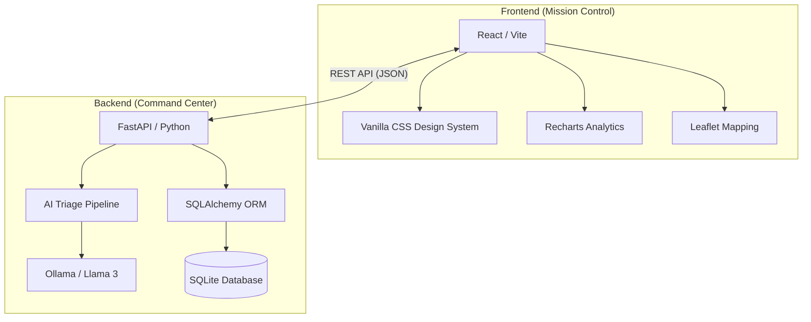

# DisasterResponder: Technical Overview & Deployment Report

**DisasterResponder** is a mission-critical, full-stack emergency coordination platform designed to provide real-time situational awareness, automated triage, and tactical dispatch management for high-stakes disaster scenarios.

---

## 🚀 Core Features & Interface

### 1. Intelligent Triage & Incident Dashboard
The central command hub provides a sub-second analysis of incoming emergency reports.
- **Local LLM Intelligence**: Powered by **Llama 3** running locally via **Ollama**, ensuring 100% data privacy and offline capability.
- **Sub-Second Triage**: The AI pipeline instantly parses raw incident reports using specialized NLP prompts.
- **Automatic Extraction**: Detects location, disaster type (Fire, Flood, Earthquake, etc.), and casualty estimates.
- **Priority Ranking**: Categorizes incidents into Low, Medium, High, or Critical severity based on LLM assessment.
- **Dynamic Geocoding**: Integrated Nominatim geocoding engine that automatically converts identified location names into precise geospatial coordinates.
- **Real-time Status Tracking**: Full lifecycle management from 'Pending' to 'Active' and 'Resolved'.

### 2. Tactical Geospatial Mapping
Integrated map visualization for precise resource positioning and threat tracking.
- **Dynamic Overlays**: Tactical map with custom-styled Leaflet layers optimized for dark-mode situational awareness.
- **Pulsing Markers**: Severity-aware markers that animate to indicate the intensity and urgency of an incident.
- **Geographic Clustering**: Automatically fits the view to active incident clusters for rapid tactical assessment.

### 3. Performance Analytics & KPIs
Data-driven intelligence to monitor system efficiency and resource strain.
- **Deployment KPI Logic**: Real-time calculation of "Average Deployment Time" incorporating a "Resource Load Penalty"—deployment times increase dynamically as system load rises, reflecting real-world responder exhaustion.
- **Capacity Monitoring**: Visual gauges for regional medical assets including ICU beds, Trauma bays, and Burn units.
- **7-Day Volume Charts**: Historical analysis of incident trends to predict future system load.
- **Financial Burn Rate**: Live expenditure tracking for personnel, fuel, and aviation resources.

### 4. Fleet & Drone Management
Coordination of ground-based responders and aerial surveillance assets.
- **Responder Status**: Real-time tracking of Fire, EMS, and Police units.
- **Drone Surveillance**: Dedicated monitoring interface for aerial reconnaissance and remote area assessment.
- **Shift Management**: Optimized scheduling to prevent personnel fatigue during extended disasters.

### 5. Secure Terminal & Emergency Alerts
Integrated security protocols for station handovers and city-wide notifications.
- **PIN-Protected Access**: Integrated security lock screen (Terminal Lock) for secure environment management.
- **Emergency Siren System**: High-priority alert activation for immediate city-wide notification.
- **Ticker Alerts**: Real-time scrolling ticker for severe weather advisories and Amber alerts.

---

## 🏗️ Technical Architecture

---

## 🛠️ Tool & Technology Mapping

| Tool | Purpose | Implementation Detail |
| :--- | :--- | :--- |
| **React (Vite)** | UI Framework | High-performance component-based architecture for real-time updates. |
| **Vanilla CSS** | Styling & Aesthetics | Custom-crafted dark mode theme with glassmorphism and animations. |
| **Ollama** | Local LLM Server | Hosts and serves Llama 3 models locally for mission-critical privacy. |
| **Llama 3** | AI Intelligence | Core logic for incident triage, extraction, and severity assessment. |
| **FastAPI** | Backend API | Asynchronous Python framework for sub-second incident processing. |
| **SQLAlchemy** | Database ORM | Reliable mapping of incident objects to persistent storage. |
| **SQLite** | Data Persistence | Lightweight, high-reliability database for mission-critical logs. |
| **Leaflet.js** | Mapping Engine | Interactive geospatial visualization with custom tactical overlays. |
| **Recharts** | Data Visualization | Dynamic charting for performance KPIs and resource monitoring. |
| **CrewAI** | Agentic Logic | (Optional/Integrated) Multi-agent coordination for complex triage logic. |

---

## 🔒 Security & Deployment
The system is built for rapid deployment in local field environments.
- **Deployment Time**: < 10 seconds for full system initialization.
- **Security**: Default PIN-based authorization for administrative functions.
- **Data Integrity**: Atomic transactions ensure incident logs remain consistent even during hardware failures.

---
*Report generated for technical submission and project documentation.* 🚨
